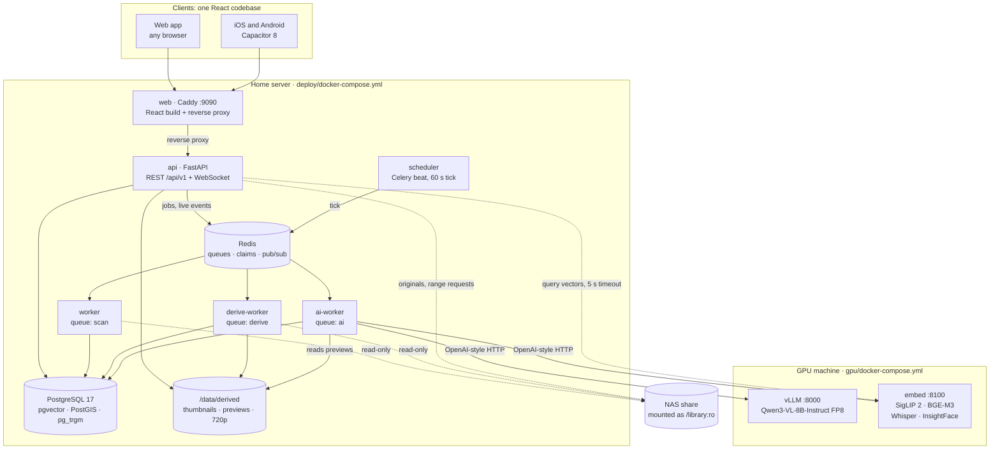

<div align="center">


### Every memory, found again.

**Muninn turns decades of family photos and videos on a NAS into a private library the whole family can search, name and talk about, running on your own hardware at home.**

**Read by area**

| [The story](#the-story) | [What Muninn does](#what-muninn-does) | [Under the hood](#under-the-hood) |
| :---: | :---: | :---: |
| For everyone. Why Muninn exists, told in a few minutes. | For families and decision makers. Features, advantages, and why not a cloud or another tool. | For engineers. Architecture, pipeline, search, and what sets it apart. |

</div>

---

## The story

### The drawer nobody opens

Every family has one. These days it hums quietly in the hallway.

It's a NAS holding **twenty-six years of family life**, more photos and videos than anyone could ever scroll through. There are birthdays shot on cameras that no longer exist, holidays in folders called `DCIM_2009_2`, and camcorder clips in formats no browser will play.

Somewhere in there, **Grandma is laughing on the beach in 2012.** Nobody has seen that video in years. Nobody could find it if they tried.

Everything is kept. Almost nothing gets looked at.

### The easy way out is the wrong one

The cloud offers to help. You upload everything, and your family's faces, places and private moments now live on someone else's servers, under someone else's terms. At this size the free tier is long gone, so you keep paying, year after year, for the space your own memories take up.

**Muninn takes a different path.**

### Meet Muninn

**Muninn is a private home for your family's photos and videos. It runs in your house, on your own hardware.**

It reads the NAS without changing a single byte. Your folders become albums. AI looks at every picture and listens to every video, on a machine in your home. Then the whole family can find, name, comment and remember together, in the browser and in its own app for iPhone and Android.

There's no subscription and no upload. Your memories stay at home.

### Why a raven

> *O'er Mithgarth Hugin and Munin both*
> *Each day set forth to fly;*
> *For Hugin I fear lest he come not home,*
> *But for Munin my care is more.*
>
> — *Grímnismál*, Poetic Edda (tr. Henry Adams Bellows, 1923)

Odin keeps two ravens. Every day at dawn they fly out over the world, and by mealtime they are back to tell him what they saw.

**Huginn** is *thought*. **Muninn** is *memory*. Odin fears for thought, but he fears for memory more.

Those four lines sum up the product. Memory is what's worth protecting, and it needs someone who flies out, looks at everything and brings it back.

Behind the scenes, the whole system is a small piece of Odin's world:

| Name | In the myth | In Muninn |
| --- | --- | --- |
| **Huginn** | The raven of thought | The worker that looks at every photo and video |
| **Mímir** | Keeper of the well of wisdom | The search |
| **Yggdrasil** | The world tree | The album tree, grown from your folders |
| **Midgard** | The world of humans | The map |
| **Walhall** | Odin's hall of the chosen fallen | Your favorites |
| **Hliðskjálf** | Odin's high seat | The admin area |

On screen, Muninn speaks plain, friendly German, for everyone from grandchildren to grandparents. The only raven you'll meet there is the one in the logo.

### Dark, calm, warm

Muninn looks like the night a raven flies through. The only things that shine are the photos.

| | Color | Role |
| --- | --- | --- |
|  | **Raven Black** `#0B0D12` | The ground everything rests on |
|  | **Midnight** `#121A2B` | Cards and bars |
|  | **Amber** `#E3A73B` | Buttons, likes and whatever is active |
|  | **Goldlight** `#F4C878` | Focus and highlights |
|  | **Parchment** `#EDE6D6` | Text on dark, and the tile behind the raven. A paler parchment, `#F5F0E6`, carries the light theme |
|  | **Rune Silver** `#C8CDD6` | Quiet secondary text and icons |

- **Amber marks what matters.** Buttons, likes, the tab you're on and the dot on the bell glow amber, so your eye knows where to go.
- **Knotwork** is the only ornament: a faint band of crossed lines, a nod to Norse interlace, between sections and never over a photo.
- **The raven mark** on a parchment tile greets you large when Muninn opens, then fades into your library.

### Life with Muninn

**7 a.m. The past comes to breakfast.**
You open the app and see *„Heute vor 14 Jahren“*: today, fourteen years ago. It gathers photos from this very day in earlier years, preferring the ones with named people, likes and stars, and never a screenshot or a double. One tap starts the slideshow.

**„Ist das Lena?“**
You name a handful of faces, and Muninn starts asking: *Is that Lena?* A yes takes one tap, and a no is remembered for good. Give the toddler from 2003 the same name as the young woman of today, and twenty-three years line up behind one name.

**Grandma's laugh, found in seconds.**
Type it the way you'd say it: `Oma Lena Strand Italien 2012`. Muninn recognises two people the family has named, a country and a year, then looks for the beach. The video opens at the second that matched. There she is, laughing.

**Sunday night, back from holiday.**
Dad copies the holiday folder into the family's photo folder on the NAS. Nobody has to import or upload anything. Within minutes the new album is simply there, in everyone's app, right where the folder sits.

**Grandpa has no e-mail address. That's fine.**
He gets a username and a starting password, handed over at the kitchen table. He holds the heart, picks the laughing face and writes the story behind the picture. Everyone with the app open sees it right away, and the reply shows up in his bell.

**Where life happened.**
You zoom into Tuscany on the map and see every photo that knows it was taken there, in one place. Give an album a place, and the old scans in it without GPS borrow it. Muninn marks those places as estimated.

**The day someone pulls the plug.**
If the NAS goes offline, Muninn assumes the share is missing, not your photos. The albums, likes and comments all stay put. If the AI machine is switched off, Muninn keeps running and catches up when it's back. It never writes to an original.

**Curious what's inside, and why not simply use a cloud?** → [What Muninn does](#what-muninn-does)

---

## What Muninn does

This part lists what Muninn does today, what each feature is good for, and how Muninn compares with other options. Everything described here is built and working, within the limits the tables mention. What isn't built yet is listed under [On the roadmap](#on-the-roadmap). German words in quotes, such as "Jetzt abgleichen", are labels, messages or example searches from the German app.

### Bring the archive in

Muninn reads what is already on the NAS. It has no upload, on purpose, so getting new phone photos onto the NAS is still up to you.

| Feature | What it does | Why it matters |
| --- | --- | --- |
| **Originals stay untouched** | The NAS is mounted read-only. Muninn never writes, moves or deletes an original. Previews are stored in a separate folder. | The software that shows the archive can't damage it. |
| **You pick the folders** | The admin chooses folders in a folder browser and can switch single subfolders off again. Unpublishing a folder removes its albums from Muninn but never deletes files. | Private folders stay out. |
| **Folders become albums** | Every folder with pictures becomes an album and every subfolder a sub-album. Folders that only hold other folders become collections, with a cover of up to four pictures from the albums below. | Twenty-six years of sorting are used as they are, with no album building. |
| **Twenty-six years of formats** | JPEG, PNG, HEIC/HEIF, WebP, TIFF and GIF. RAW from Canon (CR2, CR3), Nikon (NEF), Sony (ARW), Olympus (ORF), Panasonic (RW2) and DNG. Video in MP4, MOV, AVI, MTS/M2TS, 3GP, MPG/MPEG, WMV and MKV. | Nothing has to be converted first. |
| **Every video plays** | Each video gets a 720p H.264 copy in the preview folder. | The camcorder clip from 2005 plays on today's phone. |
| **RAW+JPEG and Live Photos count once** | A RAW file next to its JPEG, or an iPhone HEIC next to its MOV clip, counts as one picture. The extra file is listed with it. | No doubles in the albums. |
| **Dates it can explain** | Muninn takes the date from the camera (EXIF), GPS, the file name, the folder name or the file time, in that order. The info panel shows the source and labels guesses "Datum geschätzt". | Scans and photos from old cameras still land in the right year. |
| **Follows the NAS on its own** | Every 5 minutes a quick check reads only the folders that changed, and a full check runs at night. Anyone can press "Jetzt abgleichen" in an album to check it right away. | New holiday photos appear within minutes, without an import. |
| **Renamed files keep everything** | Every picture has a fixed ID and a BLAKE3 fingerprint. When a single file is renamed or moved to another folder, its likes, comments, favorites and faces stay with it. Renaming or moving a whole folder is not recognised yet: its pictures are added again as new ones and lose their likes, comments and faces. | Tidying up single files never loses the family's stories. |
| **Safe against accidents** | Muninn doesn't sync while the share isn't mounted, and a folder it can't read deletes nothing. Files that are still being copied wait until they're complete. A file that goes missing from a folder is hidden at once and only forgotten after 30 days (adjustable). A folder that vanishes from a readable share is removed at once, together with its pictures' likes, comments and faces. | An unplugged NAS can't empty the library. A single file that comes back within 30 days returns with its likes, comments and faces. |

### Find anything

| Feature | What it does | Why it matters |
| --- | --- | --- |
| **Ask in plain German** | For a query like "Oma Lena Strand Italien 2012", Muninn picks out named people, places the library has photos from, years, ranges ("2010 bis 2012"), months and seasons ("Sommer 2009"), and "Fotos" or "Videos". It shows these as chips and searches for the rest. | You type one sentence instead of filling in a filter form. |
| **Four searches in one** | Each query checks four things: what the picture shows, the meaning of its description, the exact words (description, tags, text in the image, speech in videos, camera and lens), and album and file names, including typos ("Italen"). The results are combined into one ranking. | Finds the sunset nobody ever described, and the album whose name you misspelled. |
| **Every photo described** | A vision-language model writes a German caption, tags and the scene. It reads text in the picture (signs, cakes, cards) and flags screenshots and documents. It is told never to guess names, places or occasions. | Photos that nobody ever captioned become findable. |
| **Videos by what is said and shown** | Speech is transcribed with timestamps. Every 5 seconds a frame is described if the picture has visibly changed. A hit opens the video at the matching second ("bei 0:35"), and an "Im Video" panel follows along as it plays. | You find the moment Grandpa told the story, not just the file. |
| **"Ähnliche Bilder"** | From search results, the map or a person's page, you can find pictures that look similar. | One good photo leads to the rest of the day. |
| **Searches are links** | The query, the filter (all, photos, videos) and the sort order (best match, newest) are part of the address. | You can send a search to the family as a link. |
| **Search keeps working** | If the AI machine is off, search falls back to words and names within 5 seconds and tells you so. | Search never simply fails. |

### People & places

| Feature | What it does | Why it matters |
| --- | --- | --- |
| **Faces in photos and videos** | Muninn finds faces in photos and videos and groups unnamed faces that look alike. | People are found even where nobody tagged them. |
| **Name once, found everywhere** | Naming a group creates a person. New faces are assigned to that person automatically when they match closely, or suggested with a similarity score ("Ist das Lena?"). A "no" is remembered, and faces assigned by hand are never changed. | A few names reach across twenty-six years. |
| **The family sorts it out together** | Every family member can remove a wrong face with one tap, rename people, merge them (the toddler and the adult) or hide strangers in the background. | Who is who is decided by the people who know. |
| **Faces are optional** | Face recognition is on by default. The admin can switch it off and delete all face data at once. | A household that doesn't want biometric data can turn it off and remove all of it. |
| **Place names, offline** | GPS coordinates become "Florenz, Toskana, Italien" using a place list (GeoNames) built into the server. Place names can be searched in many languages, as long as they are written in Latin letters (Florenz, Firenze, Florence). | No location is sent to an outside service to look up its name. |
| **Places for old photos** | You can give an album a place. Its photos without GPS then use it and are marked as estimated. | Scans and old camera photos appear on the map too. |
| **The map** | All photos with a place appear in clusters, each showing its newest photo. You zoom in, and close up you can open them as a list. The base map is loaded from OpenFreeMap, so the browser fetches the map tiles of the area you look at from there. The photos and their positions stay at home. | You see where life happened and can open everything from one place. |

### Relive

| Feature | What it does | Why it matters |
| --- | --- | --- |
| **The timeline** | The start page runs through the whole library: a card per year, then per month, then the days. A date scrubber jumps anywhere without loading everything. | Twenty-six years become easy to walk through. |
| **"Heute vor X Jahren"** | Every morning Muninn shows photos from this day in earlier years, or from this week if the day has none. It uses only reliable dates, leaves out screenshots, documents and duplicates, and prefers named people, likes and favorites. A tap starts a slideshow. | Something forgotten comes back every day. |
| **One start page** | Memories, the latest news, your favorites, recently added albums and the timeline. | You see what's new and what happened on this day at a glance. |
| **The viewer** | Full screen with zoom and swipe. The info panel shows the date and its source, camera, place, NAS folder, AI description, text in the image, people and comments. | Everything known about a picture is in one place. |
| **The original, one tap away** | "Original laden" downloads the untouched file under its NAS name. | Full quality whenever you need it, for printing for example. |
| **"Überblick"** | Every user sees photos and videos per year, cameras, places, people, the motifs the AI found, and how far processing has got. | The whole archive at a glance. |

### Together

| Feature | What it does | Why it matters |
| --- | --- | --- |
| **Reactions** | A tap gives a heart, and holding opens eight reactions. Everybody can see who reacted. | Grandparents can react with one tap. |
| **Comments** | Comments on every photo and every album, with replies, @mentions and likes. | The story behind a picture stays next to it. |
| **Personal favorites** | A star puts a photo or album into your own collection (Walhall), which also appears on the start page. | Everybody keeps their own best-of. |
| **"Neuigkeiten"** | A feed of everybody's comments, reactions and new pictures. Each entry links to where it happened. | You see what the family is doing without asking around. |
| **The bell** | Notifies you of replies, mentions, likes on your comments, comments on things you favorited or commented on, and new pictures per album. Related events are bundled ("Anna und 2 weitere"), and your own actions never ring. | You hear about what concerns you, not about everything. |
| **Live updates** | New comments, likes and pictures appear while the app is open, without reloading. | A conversation runs like a conversation. |

### Keep it tidy

| Feature | What it does | Why it matters |
| --- | --- | --- |
| **Duplicates found** | Exact copies, re-compressed copies (from WhatsApp, for example) and burst shots are grouped. Muninn suggests the best copy: most pixels, most complete data, the original rather than the messenger copy. | The same picture no longer shows up three times in an album. |
| **Hidden, never deleted** | The admin keeps one or more copies. The rest disappear from albums, timeline, search, map and memories, and can be shown again later. A CSV list of the hidden files helps you clean up the NAS by hand. | Albums get tidy, and Muninn still never touches a file. |
| **Clutter stays out** | Synology's `@eaDir`, `#recycle`, `.DS_Store`, `Thumbs.db` and hidden files are skipped. The list can be edited. | System files never show up as family photos. |
| **A log of changes** | Everything a sync found (new, changed, moved, missing, back) is kept for 90 days. | The admin can see what happened overnight. |

### Everywhere

| Feature | What it does | Why it matters |
| --- | --- | --- |
| **Web, iPhone and Android** | One app for the browser, packaged from the same code for iOS and Android (for now you build the phone apps yourself). Phones get a bottom bar, tablets and computers a sidebar. | Every device in the family runs the same app. |
| **Links to everything** | The album, the page and the open picture are part of the address. | You can share a picture or album with the family as a link. |
| **Dark or light** | Dark by default, a light theme (the design's Parchment), or the device's own setting. | Photos stand out, and the light theme suits daylight and older eyes. |
| **Plain German** | The whole interface uses clear German. | Every generation finds its way. |
| **Signed in, safely** | Passwords are stored as Argon2id hashes. Phones keep their sign-in in the Keychain or Keystore. Picture links are signed and expire. Out of the box Muninn speaks plain HTTP inside the home network; HTTPS is on the roadmap. | Private photos stay behind a login. |

### For the admin

| Feature | What it does | Why it matters |
| --- | --- | --- |
| **Closed circle** | There is no open sign-up and no e-mail is needed. The admin creates accounts and hands over a one-time starting password in person, and everyone sets their own password at first login. | Grandparents need no e-mail address, and strangers can't register. |
| **Folders page** | Status and progress of every published folder. From here the admin can read a folder now, pause, resume, cancel, unpublish or switch subfolders off. | The admin controls what the family sees without touching the NAS. |
| **Engine room ("Aufträge")** | Shows what each worker is doing right now, the work left per stage, the queues and the schedule. Each AI service has a light: green, red or grey, with its response time. | The admin sees at once whether the NAS is being read and whether the AI machine answers. |
| **Swappable AI** | Five connections (describe, picture vectors, text vectors, speech, faces), with spare profiles and a "Verbindung testen" button. Describing, text vectors and speech use standard OpenAI-compatible endpoints. Picture vectors and faces rely on Muninn's own embedding service. | A model or a machine can be swapped without a new release. |
| **Works with the AI machine off** | If the AI machine doesn't answer, its stages pause and resume on their own. The newest photos are processed first. Albums, timeline and map work long before the AI is finished. | The GPU machine doesn't have to run all the time, and Muninn catches up. |
| **Settings** | Preview size and quality, video height, sync intervals, how long missing files are kept, an optional pause before mass deletions, and faces on or off. | Muninn can be adjusted to the household's NAS and server. |
| **Two short setups** | `./deploy/setup.sh` asks for the paths, generates the secrets, starts the Muninn stack and creates the first admin. The AI machine gets its own `docker compose up -d` from `gpu/`. Database updates apply themselves. | No subscription and no cloud account. |

### Why Muninn, in short

- **Your archive stays where it is, untouched.** Muninn reads the NAS read-only, so there is nothing to upload and nothing to migrate.
- **The folders you already know become the albums.** Twenty-six years of sorting are kept, not redone.
- **A picture keeps its identity.** You can rename single files or move them between folders, and the likes, comments, favorites and names stay with the picture. Renamed or moved folders are not recognised yet (see [On the roadmap](#on-the-roadmap)).
- **Search that understands German.** One query covers what a photo shows, what its description means, the text in it and what is said in a video.
- **The AI runs in your house.** In the documented setup, every model runs on your own GPU machine. The AI connections could point elsewhere, but only if the admin chooses that.
- **The whole family works with the whole library.** Comments, reactions and names work on every photo and album, not only in shared albums.
- **No storage bill and no account to lose.** Capacity is whatever your NAS holds, and no provider can close the account.
- **One database.** Comments, names, places and the search index all live in one PostgreSQL database, so a single `pg_dump` covers them. Previews are derived from the originals and live in their own folder.
- **Built to survive outages.** An unplugged share or a switched-off AI machine pauses the work but never wipes anything.

### Why not the cloud?

Google Photos, iCloud and similar services are polished, and for a small library they can be the cheaper choice. For a family archive of one to two terabytes, four things weigh against them.

**1. The rent never ends.** Prices for 2 TB as of September 2026:

| Service | 2 TB | Ten years, before any price rise |
| --- | --- | --- |
| Google One / "Google AI Plus" (EU) | €9.99 per month[^why-google-price] | about €1,200 |
| Apple iCloud+ | $9.99 per month[^why-icloud-price] | about $1,200 |
| Amazon Photos | $11.99 per month, or about $120 per year[^why-amazon-price] | about $1,200 to $1,440 |
| Ente Photos | $19.99 per month[^why-ente-price] | about $2,400 |
| Microsoft 365 Family | $129.99 per year, but 1 TB *per person*, not shared[^why-ms-price] | about $1,300, and a 2 TB archive doesn't fit in one account |

The bill keeps coming for as long as you keep the archive there, and plans get repackaged. By May 2026 the plain 2 TB plan had quietly disappeared from Google's US site, and storage is now sold mostly inside AI bundles.[^why-google-repack] To be fair, Muninn isn't free either: a home server, a GPU machine and electricity cost money. What you don't pay is rent per terabyte.

**2. Your photos are analysed under someone else's rules.**

- Google says it doesn't train generative AI models *outside of Google Photos* with your personal data in Google Photos.[^why-google-ai] Google confirmed in 2025 that Ask Photos features aren't offered in Texas and Illinois. 9to5Google traces this to face grouping, which stores facial geometry and runs into both states' biometric privacy laws.[^why-ask-photos]
- Defaults change without asking. OneDrive rolled out AI face grouping switched on, and preview users were told they could turn it off only three times a year.[^why-onedrive] Apple switched on "Enhanced Visual Search", which sends encrypted fingerprints of parts of your photos (not the photos themselves) to Apple for landmark matching. The encryption is strong, but nobody was asked first.[^why-apple-evs]
- Protection depends on politics. After a UK government order, Apple withdrew end-to-end encrypted iCloud Photos (Advanced Data Protection) for UK users in February 2025.[^why-apple-adp]
- Amazon keeps image-recognition data until you disable the feature or the account ends.[^why-amazon-faces]

With Muninn, face data stays on your own machines at home, and the admin can switch recognition off and delete all of it.

**3. The deal can change, and leaving takes work.**

- Google ended free unlimited "High quality" storage in June 2021.[^why-google-2021] Flickr cut free accounts from 1 TB to 1,000 photos in 2019 and deleted the rest.[^why-flickr] Amazon shut down Amazon Drive for general files at the end of 2023; only photos and videos stayed, in Amazon Photos.[^why-amazon-drive]
- Google Takeout exports everything, but in split archives with dates, GPS and descriptions in separate JSON files. If you import them as they are, photos can show the export date instead of the day they were taken.[^why-takeout]
- In fairness, the law is improving. The EU Data Act already requires export in a machine-readable format and bans switching fees from January 2027.[^why-data-act]

With Muninn, the originals are ordinary files in your own folders. Comments, names and likes live in a PostgreSQL database on your own server; there is no export button for them yet.

**4. Losing the account can mean losing the photos.**

- In 2021 Google's automatic scanning flagged a father's photos of his toddler, taken for the doctor (The New York Times reported the case in 2022). His account was closed, and with it his email, contacts, photos and phone number. Police found no crime, and Google still refused to restore the account.[^why-google-lockout]
- In December 2025 a long-time Apple developer was locked out of his Apple Account and more than 20 years of data after redeeming a compromised gift card. Access was restored only after public attention.[^why-apple-lockout]
- The policies are written down. Google Photos may delete photos after 2 years of inactivity (unless you pay for Google One), or after 2 years over the storage limit.[^why-google-inactive] When Prime or a paid Amazon plan lapses, anything over 5 GB is deleted after 180 days, newest first.[^why-amazon-lapse]

**Where the cloud is better:** automatic phone backup, copies in another building, editing, and very polished search. Muninn is not a backup, so keep a copy of your NAS outside the house.

### Why not another self-hosted tool?

Muninn isn't the first self-hosted photo app, and it is the youngest. Most of its individual features exist elsewhere, some in more mature form. What Muninn adds is the combination:

- the existing NAS archive left untouched
- folders as albums
- search over what photos show and what videos say
- a family social layer on the whole library

The comparison below is as of September 2026.

| | Muninn | Immich[^why-immich] | PhotoPrism[^why-photoprism] | Synology Photos[^why-synology] | Google Photos / iCloud[^why-bigcloud] |
| --- | --- | --- | --- | --- | --- |
| Uses the NAS folders where they are | ✓ read-only | ✓ external library | ✓ read-only mode | ✓ Synology NAS only | ✗ upload |
| Folder tree becomes the album tree | ✓ | partial: folder view | ✓ | partial: folder view | ✗ |
| Automatic phone backup | ✗ | ✓ | partial: WebDAV | ✓ | ✓ |
| Search in plain sentences | ✓ | ✓ | ✗ | ✗ | ✓ |
| Search by what is said in videos | ✓ | ✗ | ✗ | ✗ | ✗ |
| Face recognition | ✓ | ✓ | ✓ | partial: some models | ✓ |
| Comments and likes | ✓ every photo and album | partial: shared albums | ✗ | ✗ | partial: shared albums |
| Native iOS and Android apps | partial: build yourself | ✓ | ✗ web app (PWA) | ✓ | ✓ (iCloud: Apple only) |
| AI runs on your own hardware | ✓ | ✓ | ✓ | ✓ | partial: Apple on the device, Google in its cloud |
| No storage subscription | ✓ | ✓ | ✓ | ✓ | ✗ |
| Mature and widely used | ✗ new in 2026 | ✓ | ✓ | ✓ | ✓ |

Some table cells need a note:

- **Speech in videos:** "✗" means the product doesn't advertise it at the time of writing. Apple Photos can find visual moments in videos on the device.
- **PhotoPrism and Synology:** the "✗" for plain-sentence search is based on PhotoPrism's documentation and a third-party comparison (September 2026).
- **Change is fast:** Immich 3.2 (September 2026) added a new search API that combines several filters with AND and OR.

**What the others do better:**

- **Immich** is far ahead on maturity (stable since October 2025, more than 1,500 contributors), phone backup, editing, share links and community. It relies on picture vectors (CLIP) plus text recognition, and a maintainer has argued that AI-written captions would add little to that (March 2026). Muninn writes a caption for every picture and searches it both by meaning and by exact words.
- **PhotoPrism** can also caption photos with a vision model (through Ollama or OpenAI) and has share links and WebDAV. Muninn goes further in what it does with captions: it searches them by meaning together with picture vectors, full text and video speech in one ranking.
- **Synology Photos** is free on a Synology, needs no extra hardware and backs up phones.
- **Google Photos and iCloud** offer automatic backup, strong editing, very mature search and copies outside your house. iCloud also offers optional end-to-end encryption, which Muninn does not.
- **Ente Photos** is worth a look if end-to-end encryption matters most to you.
- **Muninn** needs real hardware: a Docker host with access to the NAS, plus a PC with an NVIDIA graphics card (the guide is sized for a 24 GB card). It is meant for the home network, and it has no upload.

### On the roadmap

**Planned, not built yet:**

- recognising renamed, moved and vanished folders, so their pictures keep their likes, comments and faces and get the 30-day grace period
- push notifications to phones (the settings and quiet hours are already there)
- offline map tiles
- App Store and Play Store releases
- built-in HTTPS for access from outside the house
- automatic database backups
- an optional NAS agent that reports new files in seconds instead of minutes
- an English interface
- playing the motion of Live Photos
- a fresh AI pass over photos whose pixels were edited on the NAS

[^why-google-price]: Google One plans, <https://one.google.com/about/plans>; European 2 TB pricing as "Google AI Plus", Internxt, <https://blog.internxt.com/google-one-pricing/>.
[^why-icloud-price]: Apple Support, iCloud+ plans and pricing, <https://support.apple.com/en-us/108047>.
[^why-amazon-price]: WhistleOut, Amazon Photos storage, <https://www.whistleout.com/CellPhones/Guides/amazon-photo-storage>.
[^why-ente-price]: Ente pricing, <https://ente.com/pricing>.
[^why-ms-price]: Microsoft 365 plan comparison, <https://www.microsoft.com/en-us/microsoft-365/buy/compare-all-microsoft-365-products>.
[^why-google-repack]: Android Authority, May 2026, <https://www.androidauthority.com/google-one-plans-confusion-2026-3669231/>.
[^why-google-ai]: Google Photos Help, <https://support.google.com/photos/answer/15344015?hl=en>.
[^why-ask-photos]: 9to5Google, October 2025, <https://9to5google.com/2025/10/16/google-confirms-ask-photos-isnt-available-in-some-states/>.
[^why-onedrive]: PC Gamer, <https://www.pcgamer.com/software/ai/preview-users-have-noticed-onedrives-ai-driven-face-recognition-setting-is-opt-out-and-can-only-be-turned-off-three-times-a-year/>. Windows Central reported that the setting could be changed more often on the web, <https://www.windowscentral.com/microsoft/onedrives-ai-face-scanning-feature-suggests-it-can-only-be-disabled-3-times-a-year-but-that-doesnt-seem-right>.
[^why-apple-evs]: Apple Support, Enhanced Visual Search, <https://support.apple.com/en-us/122033>; Michael Tsai, January 2025, <https://mjtsai.com/blog/2025/01/01/privacy-of-photos-apps-enhanced-visual-search/>.
[^why-apple-adp]: Privacy Guides, February 2025, <https://www.privacyguides.org/articles/2025/02/28/uk-forced-apple-to-remove-adp/>.
[^why-amazon-faces]: Amazon Photos terms, quoted by Ethan Elasky, <https://ethanelasky.github.io/posts/amazon-images.html>.
[^why-google-2021]: Google, <https://blog.google/products/photos/storage-changes/>.
[^why-flickr]: PetaPixel, February 2019, <https://petapixel.com/2019/02/04/flickr-will-delete-photos-tomorrow-if-youre-over-the-new-limit/>.
[^why-amazon-drive]: Tom's Hardware, <https://www.tomshardware.com/news/amazon-drive-discontinued-december-2023>.
[^why-takeout]: Metadata Fixer, <https://metadatafixer.com/learn/google-takeout-json-files-explained>; Szymon Kocur, <https://szymonkocur.com/posts/google-photos-takeout-mess/>.
[^why-data-act]: European Commission, Data Act explained, <https://digital-strategy.ec.europa.eu/en/factpages/data-act-explained>.
[^why-google-lockout]: The New York Times, reprinted by The Seattle Times, <https://www.seattletimes.com/business/a-dad-took-photos-of-his-naked-toddler-for-the-doctor-google-flagged-him-as-a-criminal/>; 9to5Google, August 2022, <https://9to5google.com/2022/08/22/google-locked-account-medical-photo-story/>.
[^why-apple-lockout]: AppleInsider, <https://appleinsider.com/articles/25/12/13/locked-out-how-a-gift-card-purchase-destroyed-an-apple-account>; TidBITS, <https://tidbits.com/2025/12/17/compromised-apple-gift-card-leads-to-apple-account-lockout/>.
[^why-google-inactive]: Google Photos Help, <https://support.google.com/photos/answer/10100180?hl=en>.
[^why-amazon-lapse]: Alphr, <https://www.alphr.com/amazon-photos-what-happens-cancel-prime/>.
[^why-immich]: Immich on GitHub, <https://github.com/immich-app/immich>; stable 2.0, <https://linuxiac.com/immich-reaches-first-ever-stable-release-with-version-2-0/>; v3.0, <https://immich.app/blog/v3.0.0-release>; v3.2, <https://alternativeto.net/news/2026/9/immich-3-2-debuts-new-search-api-cluster-groups-workflows-expansion-and-much-more/>; v2.2.0 (text recognition), <https://github.com/immich-app/immich/releases/tag/v2.2.0>; docs on searching, <https://docs.immich.app/features/searching/>, external libraries, <https://docs.immich.app/features/libraries/>, and remote machine learning, <https://docs.immich.app/guides/remote-machine-learning/>; discussions <https://github.com/immich-app/immich/discussions/26690>, <https://github.com/immich-app/immich/discussions/25637>, <https://github.com/immich-app/immich/discussions/8596>, <https://github.com/immich-app/immich/discussions/22229>.
[^why-photoprism]: PhotoPrism features, <https://www.photoprism.app/features/>; editions, <https://www.photoprism.app/editions>; release notes, <https://docs.photoprism.app/release-notes/>; caption generation, <https://docs.photoprism.app/developer-guide/vision/caption-generation/>; config options (read-only mode), <https://docs.photoprism.app/getting-started/config-options/>.
[^why-synology]: Synology Photos specifications, <https://www.synology.com/en-eu/dsm/7.2/software_spec/synology_photos>; Synology, models with face recognition, <https://kb.synology.com/en-us/DSM/tutorial/Which_Synology_NAS_models_support_the_facial_recognition_feature_on_Synology_Photos>; NAS AI photo search compared, September 2026, <https://needtoknowit.com.au/blog/ai-photo-search-on-nas-synology-qnap-and-ugreen-compared/>.
[^why-bigcloud]: Google Photos Help, <https://support.google.com/photos/answer/15344015?hl=en>; Google partner and family sharing, <https://support.google.com/families/answer/6131416?hl=en>; Apple Support, <https://support.apple.com/en-us/102651>; AppleInsider on Shared Library and Shared Albums, <https://appleinsider.com/inside/icloud/vs/icloud-shared-photo-library-vs-shared-albums-in-photos>; MacRumors on natural-language search, <https://www.macrumors.com/how-to/ios-use-natural-language-search-photos/>; Tom's Guide on moments in videos, <https://www.tomsguide.com/phones/ios-18-1-lets-you-search-for-moments-in-videos-heres-how-it-works>.

---

## Under the hood

Muninn runs on two machines, each with its own Docker Compose stack.

- **The home server** runs eight containers. Caddy serves the React app and is the only way in. A FastAPI process handles REST and a WebSocket. Three Celery workers on three separate queues (`scan`, `derive`, `ai`) and a scheduler form Huginn, the indexing pipeline. Redis carries the queues, the claims and the live events. The NAS is mounted **read-only** into every server container.
- **PostgreSQL 17 is the only database.** Relational data, vectors, German full text, trigrams and geodata all live in one place, and can be backed up with a single `pg_dump`. Previews live in their own folder and are derived from the originals.
- **The GPU machine** runs vLLM with Qwen3-VL-8B and Muninn's own embedding service (SigLIP 2, BGE-M3, Whisper, InsightFace). Muninn reaches both over OpenAI-style HTTP, so the home server needs no graphics card, and each model can be swapped for another server that speaks the same API.
- **Web, iPhone and Android** run the same React codebase, packaged with Capacitor.

### Architecture



- **One image, one version.** The API, all three workers and the scheduler run from one server image and differ only in their command. Only the API runs Alembic migrations on start. The other containers set `MUNINN_RUN_MIGRATIONS=0`, so on a fresh deployment they cannot race it.
- **Three queues, three workers.** `scan` reads the NAS and handles metadata, places, duplicates, memories and housekeeping. `derive` makes previews, 720p transcodes and fingerprints. `ai` is the only queue that talks to the GPU machine; it reads the previews, never the NAS. A video transcode that takes minutes never holds up reading the NAS, and a slow GPU never holds up previews.
- **One origin.** Caddy serves the built app and forwards `/api`, `/health` and `/ready`, so browsers and phones talk to one address. Hashed assets are cached for a year as `immutable`, and responses are compressed with zstd or gzip. The API port is bound to `127.0.0.1`, and only port 9090 is reachable from the house.
- **Read-only by construction.** The library is mounted `:ro`, so the operating system itself refuses writes, even from a bug. Derived files live in a separate bind mount on local storage. The scanner does not follow symbolic links.
- **Sized for one consumer GPU.** vLLM is pinned to `v0.29.0`, not `latest`. It runs with FP8 weights and KV cache, a 16,384-token context, 66% of GPU memory, at most 8 sequences, and at most one image and no video per prompt. That leaves room for SigLIP 2, BGE-M3 and Whisper (about 5 GB together) on the same card, and the settings are tuned for a 24 GB card (see [The reference GPU machine](#the-reference-gpu-machine-one-rtx-4090)). Faces run on the CPU by default. After a reboot the embedding service waits up to 1,800 s for vLLM's `/health` before it loads its own weights. Otherwise vLLM would measure GPU memory while the other models load and fail with a negative KV cache.

### From file to memory: the pipeline

| # | Stage | Result | Tools | Queue |
| --- | --- | --- | --- | --- |
| 1 | Discover | Folder signature, 30 s stability window, content hash, quick hash, file moves and "touched" files | BLAKE3 | `scan` |
| 2 | Metadata | Capture date from 5 sources (with where it came from), GPS, camera, lens, dimensions, duration | exiftool, ffprobe | `scan` |
| 3 | Previews | 400 px thumbnail and 2048 px preview (WebP, q82), a video poster frame, an H.264 720p transcode, a pixel hash | libvips, ffmpeg, exiftool (embedded JPEG from RAW) | `derive` |
| 4 | Fingerprint | 64-bit DCT perceptual hash, read from the thumbnail | pyvips | `derive` |
| 5 | Picture vector | Makes the picture findable by a sentence | SigLIP 2 | `ai` |
| 6 | Transcript (videos) | Timed segments, with the credits Whisper invents on silence filtered out | Whisper large-v3-turbo, ffmpeg (16 kHz mono) | `ai` |
| 7 | Description | German caption, up to 20 tags, scene, text in the image, flags, quality, and a weighted German `tsvector` | Qwen3-VL-8B on vLLM, JSON schema output | `ai` |
| 8 | Caption vector | The meaning of the description | BGE-M3 | `ai` |
| 9 | Faces | Face boxes and landmarks, 512-d vectors, automatic names and suggestions | InsightFace buffalo_l (SCRFD + ArcFace) | `ai` |
| 10 | Places | Nearest GeoNames place within 50 km, or the place set on its album (marked as estimated) | PostGIS, GeoNames | `scan` |
| 11 | Duplicates | Groups of exact copies, near copies and bursts, with the best copy chosen | BLAKE3, perceptual hash, SigLIP | `scan`, every 15 min |
| 12 | Memories | "Today, X years ago" | PostgreSQL | `scan`, daily at 06:00 |

**How the work moves:**

- **The clock drives everything.** The scheduler ticks every 60 s.
  - A quick sync runs every 300 s and skips any folder whose BLAKE3 signature over its sorted listing has not changed.
  - A full sync lists every folder and checks every file's size and time at 03:00 in the admin's time zone.
  - Intervals are read from the database, so changing them in the admin area needs no restart.
- **The AI pulls its work.** On each tick, the scheduler gives the `ai` queue at most 200 media per stage, newest first, that still lack a result for the active model. The rest of the backlog waits in PostgreSQL, not in Redis. After a model switch, or a day with the GPU machine switched off, Muninn catches up without anyone starting a job.
- **Nothing is queued twice.** A Redis claim (`SET NX`, 1 h TTL) per stage and medium prevents it. A second sync request for a folder that is already being read is folded into the running read, which then runs once more at the end.
- **Delivery settings.** Tasks are acknowledged only after they finish (`acks_late`), with a prefetch of 1. Redis priorities put manual syncs (0) ahead of quick syncs (5) and the nightly run (8). The code calls this a preference, not a guarantee.
- **Live updates.** Workers publish events over Redis pub/sub, and the API forwards them to open apps over one WebSocket per tab. New previews are announced at most once every 10 s. Each folder is committed on its own, so albums appear while a first import of 150,000 files is still running.

### How a search works

1. **Understand.** Deterministic rules pull German years, ranges ("2010-2012", "bis"), months, seasons ("Sommer 2009", where winter runs into the next year) and the words for photo or video out of the query. Places are matched against GeoNames places the library actually has photos from, and persons against the names given to faces. The rest is searched as text.
2. **Embed.** The remaining words go to SigLIP 2 (for the picture list) and BGE-M3 (for the caption list) in parallel, with a 5 s timeout.
3. **Retrieve.** One SQL statement builds four ranked lists of 200 candidates each:
   - **Picture vectors** (SigLIP 2, cosine distance ≤ 0.92)
   - **Caption vectors** (BGE-M3, cosine distance ≤ 0.50)
   - **German full text** over captions (weighted: caption A, tags and scene B, text in the image and time of day C), video frame captions, transcripts, and camera and lens names
   - **pg_trgm word similarity** ≥ 0.5 on album paths and file names, so "Italen" still finds "Italien" (0.57)
4. **Filter inside, not after.** Date range, photo or video, album subtree, camera, place and persons (everyone named must be in the picture) sit inside each of the four queries. Each query sets `hnsw.ef_search = 200` and `hnsw.iterative_scan = relaxed_order` (pgvector 0.8), so under a narrow filter such as "Oma Lena Italien 2012" the index keeps searching instead of returning too few vector candidates.
5. **Fuse.** Reciprocal Rank Fusion, `score(m) = Σ 1 / (60 + rank_i(m))`, merges the lists: a medium near the top of several lists beats one at the top of a single list. SigLIP ranks pictures well but cannot tell when nothing fits. So a hit from the picture list alone counts only when another list confirms it, or when the medium has no description yet and is among the 20 nearest. Both vector thresholds were measured on 702 media from the real library, and a picture-only hit needs a second list to confirm it, so a search for something that is not there returns few or no results instead of the nearest random pictures.
6. **Degrade gracefully.** If no AI profile is set up, the search runs on full text and names alone. If the GPU machine does not answer within 5 s, it does the same and the response says `degraded: true`.

"Similar pictures" uses the same machinery: the nearest SigLIP picture vectors with the same HNSW settings, leaving out hidden duplicates. Video hits keep their second, so the viewer can jump to the moment.

**Where the vectors live.**

- There is one table per kind of vector (`image_embeddings`, `caption_embeddings`, and the `faces` table), with the model name as a column. In the two embedding tables the primary key is `(media_id, model)` (faces have their own ID, since a picture can hold many); the column is `halfvec` with no fixed length, and a `CHECK` ensures that `vector_dims` equals the stored dimensions.
- Speed comes from a **partial HNSW index (`halfvec_cosine_ops`) per model and dimension**. The index is created when a model's first vectors arrive, under `pg_advisory_xact_lock`, so parallel first writes cannot deadlock. The search writes the model name and length into the query as literals, so the planner picks that model's index.
- A table per model was rejected deliberately: it would mean creating tables at runtime every time an admin typed a model name. Tables and columns change only in Alembic migrations; at runtime Muninn only adds a partial index.
- All vector SQL (`<=>`, `halfvec`, HNSW) lives in `server/muninn/search`, and nowhere else.

### What sets it apart

- **Hybrid search in a single SQL statement.** Vector, full-text, trigram, geo and person filters run in one query and are fused by RRF. *Why it matters:* there is no second vector store to keep in sync, results cannot drift from the data, one `pg_dump` backs up all indexed data, and filters shape the candidates instead of trimming a finished result.
- **Several models side by side, with no schema change.** Each kind of vector has one table, with a partial HNSW index per model that is created at runtime. *Why it matters:* trying a new embedding model needs no migration. Switching back is instant because the old model's vectors are still there, and every model still searches with its own index.
- **AI on a separate machine, over HTTP.** All AI goes through four small protocols (`Embedder`, `Analyzer`, `Transcriber`, `FaceDetector`) behind five kinds of profile. Base URL, model, key and timeout are set in the admin area, and the server code contains no model names or addresses. Muninn's own embedding service puts SigLIP 2, BGE-M3, Whisper and InsightFace behind OpenAI-shaped endpoints. *Why it matters:* the always-on box stays small and quiet, and the heavy work runs on a PC that is already in the house. The describing model and the text vectors can come from vLLM, Ollama or any other OpenAI-compatible server, and speech from any server with OpenAI's transcription endpoint; picture vectors and faces rely on conventions of Muninn's own embedding service (images as data URLs on `/v1/embeddings`, and `/v1/faces`).
- **Videos understood moment by moment.**
  - ffmpeg decodes each video into memory through a pipe, with no temporary files, and yields one frame every 5 s.
  - A frame goes to the model only if it differs visibly from the last one sent. Measured on 12 videos from the library, about 93% of all seconds differ visibly from the second before.
  - Whisper runs first, so the summary knows what was said. Frames are summarised in stages of 100, and each frame keeps its timestamp.
  - *Why it matters:* a search finds the moment inside a long home video, not just the file.
- **An AI backlog that heals itself.** Pending work is a query against the database, not a queue that has to be replayed. *Why it matters:* the GPU machine can be switched off, busy with a game or given a new model, and Muninn catches up when it is back, with no one needing to step in.
- **Place names without leaving the house.** GeoNames data (places with at least 1,000 inhabitants, with German names, CC BY 4.0) is built into the server image as one compact file and loaded into PostgreSQL on first start. A GiST `<->` search finds 8 candidates, and `ST_DistanceSphere` picks the nearest. The map clusters on the server with `ST_SnapToGrid` in Web Mercator, in cells 60 screen pixels wide. *Why it matters:* no GPS coordinate is ever sent to a geocoding service, and 150,000 points reach the phone as a few dozen circles.
- **A scanner that expects the NAS to fail.** Mount check, no deletions from incomplete listings, a stability window, and move detection by hash (details below). *Why it matters:* an unmounted share or a folder that cannot be listed never wipes albums, likes or named faces, and a file renamed or moved into another existing folder keeps them. Renaming or removing a whole folder is not protected yet (see [Known limits](#known-limits)).

### Engineering strengths

**Integrity**

- **Identity by ID and content, never by path.**
  - Every medium has a fixed UUID and a BLAKE3 content hash, read in 1 MiB chunks so a 40 GB video never has to fit in memory. A quick hash over the first and last MiB plus the file size makes cheap comparisons possible. Likes, comments and faces hang on the ID.
  - Changes are detected in three steps: listing (size and mtime), then quick hash, and only then a full read. A file whose content is unchanged but whose timestamp moved counts as "touched" and keeps everything derived from it.
  - A file renamed or moved into another existing folder is matched by size and quick hash and confirmed by a full hash before it keeps its ID.
- **Idempotent, versioned stages.** Nine stages (metadata, previews, picture vector, transcript, description, caption vector, faces, fingerprints, places) each check their own version constant and skip work that is already current. Raising one version re-runs that stage and the stages that build on its output, and until a medium has been redone its old result keeps answering searches.
- **Transactional stage writes.** Each stage writes its result in one transaction. Storing a description writes the caption, its weighted `tsvector` and the removal of the outdated caption vector together, so a search never returns a photo for words its current caption no longer contains. New previews get file names that include part of the content hash. The database switches to them first, and only after that commit are the old files deleted. Derived files are spread over two levels of subfolders.
- **Safety net for the library.**
  - Before every sync Muninn checks that the root is still on the filesystem device (`st_dev`) it was published on, or that a `.muninn-root` marker file is present. An unmounted share looks exactly like an empty folder, so this matters.
  - A folder that cannot be fully listed proves nothing and deletes nothing.
  - Empty files are skipped, and files still being copied wait until two listings 30 s apart agree.
  - A vanished file in a folder that still exists is marked `MISSING` and hidden for 30 days, and it comes back intact if it returns. A folder that disappears currently takes its album and media with it at once. Every finding goes into a change log kept for 90 days.
  - A tested mass-deletion pause (thresholds in percent and in files) is available for vanished files, but off by default since migration 0015; it does not yet cover a whole folder that disappears.

**Resilience**

- **Pause instead of failing.** The code separates "machine unreachable" (`AiUnreachableError`) from "bad answer about one picture". An unreachable machine pauses that stage for 300 s instead of failing thousands of media a minute. The admin area shows the pause and can end it early.
- **Recovery on restart.** A starting worker releases the claims left behind by its predecessor. The scan worker also releases read locks and re-queues any read that was interrupted, which is safe because every step of a read can be repeated.
- **AI health at a glance.** The connection test and health view ask every active interface in parallel, with a 10 s timeout, and cache the answer for 30 s. At most one profile per kind can be active, enforced by a unique constraint in the database.

**Security and API**

- **Signed URLs that stay the same for an hour.**
  - Media URLs carry an HMAC-SHA256 signature over media ID, variant and expiry, checked in constant time.
  - The expiry is rounded to the end of the next full hour, so every URL issued within that hour is identical and valid for 1 to 2 hours. With `Cache-Control: private, max-age=3600`, the browser really does cache thumbnails.
  - The endpoint also accepts a bearer token, serves videos and originals with range requests, and hands back its database connection before streaming.
- **Sessions.**
  - Passwords are hashed with Argon2id and rehashed when the library defaults get stronger.
  - Access tokens are HS256 JWTs valid for 15 minutes.
  - Refresh tokens are 32 random bytes, stored only as SHA-256, and rotate on every use within a 30-day family. Reusing an old refresh token revokes the whole family.
  - Failed logins are limited to 10 per client address per 5 minutes; behind Caddy the API currently sees the proxy's address, so the limit counts all failed logins together.
- **Web and native tokens handled differently.**
  - In the browser, the refresh token lives in an `httpOnly`, `SameSite=Lax` cookie scoped to `/api/v1/auth`, and the access token lives only in memory.
  - The native apps use no cookies at all: they keep the refresh token in the iOS Keychain or Android Keystore and send `Authorization: Bearer`.
  - The WebSocket sends its token as a subprotocol, so it never ends up in a URL or a proxy log.
  - A refresh already in flight is shared by all requests, so parallel 401s never trigger the server's replay detection.
- **Private by design.** Admins create the accounts, and there are two roles. Starting passwords are generated so they can be read out loud (about 60 bits, no look-alike characters), and everything stays closed until the user sets their own. The API, worker and scheduler containers run as a non-root user, and the API refuses to start without `MUNINN_JWT_SECRET`.
- **A clear contract.**
  - Everything lives under `/api/v1`, with an OpenAPI description.
  - Every error is RFC 9457 Problem Details (`application/problem+json`) with a stable URN type such as `urn:muninn:problem:invalid-cursor`.
  - Paginated lists use opaque cursors, never page numbers.
  - CORS admits only the Capacitor app origins.
  - `/health` and `/ready` (which checks database and Redis) sit outside the API for Docker.

**Code quality**

- **Strict typing end to end.** The server passes `mypy --strict` and the app TypeScript `strict`. The TypeScript client is generated from the OpenAPI description with openapi-typescript and openapi-fetch, and is never edited by hand.
- **A fixed layout per domain.** Domains follow the same three files: `api/v1/<domain>.py` (HTTP and permissions), `api/schemas/<domain>.py` (the contract) and `<domain>/service.py` (logic). Services hold the logic and nearly all database access; a few routers still read single rows themselves.
- **One gate.**
  - `./check.sh` runs three suites in parallel: the server (pytest, ruff check, ruff format, mypy), the embedding service (the same four) and the app (Vitest, ESLint, `tsc`).
  - Ruff enables the security (`S`), async (`ASYNC`) and annotation (`ANN`) rule sets.
  - Database tests run against a real PostgreSQL in a throwaway testcontainer built from the project's own image, and every migration is tested both up and down.
- **714 automated tests.** 488 on the server (376 of them against real PostgreSQL), 35 in the embedding service and 191 in the app.

### Tech stack

| Layer | Technology |
| --- | --- |
| **App** | React 19, TypeScript (strict), Vite, TanStack Router, Query and Virtual, Zustand, Tailwind CSS, shadcn/ui, PhotoSwipe, MapLibre GL 6 (base map from OpenFreeMap), i18next |
| **Mobile** | Capacitor 8: the same app packaged for iOS and Android, with tokens in the Keychain or Keystore |
| **API client** | openapi-typescript and openapi-fetch, generated from `/api/v1/openapi.json` |
| **API** | Python 3.13, FastAPI, Pydantic v2, SQLAlchemy 2 (async, asyncpg), Alembic, PyJWT, argon2-cffi |
| **Pipeline** | Celery on Redis 7, with three queues (`scan`, `derive`, `ai`) and Celery beat as the clock |
| **Media** | libvips (pyvips), exiftool, ffmpeg and ffprobe, BLAKE3 |
| **Database** | PostgreSQL 17, the only database: pgvector 0.8.1 (`halfvec`, HNSW), PostGIS 3, pg_trgm, German full text |
| **Places** | GeoNames, built into the server image; no geocoding service at runtime |
| **Vision and language** | Qwen3-VL-8B-Instruct (FP8) on vLLM v0.29.0 |
| **Embeddings** | SigLIP 2 so400m-patch14-384 (pictures and search words), BGE-M3 (descriptions) |
| **Speech** | Whisper large-v3-turbo |
| **Faces** | InsightFace buffalo_l on ONNX Runtime: SCRFD (det_10g) detection, ArcFace (w600k_r50) 512-d vectors |
| **Embedding service** | FastAPI with OpenAI-compatible `/v1/embeddings`, `/v1/audio/transcriptions` and `/v1/models`, plus `/v1/faces` in the same style, behind a bearer token |
| **Delivery** | Docker Compose on two machines, with Caddy in front |
| **Quality** | pytest, testcontainers, mypy (strict), ruff, Vitest, ESLint, `tsc`, Prettier |

### By the numbers

Counted from the repository on 2026-09-22.

| | |
| --- | --- |
| **Automated tests** | 714: 488 server, 35 embedding service, 191 app |
| **HTTP API** | 99 operations under `/api/v1`, plus 1 WebSocket |
| **Schema** | 32 Alembic migrations, 27 ORM tables plus 2 vector tables |
| **Code** | about 18,600 lines of server Python, 15,100 lines of app TypeScript, 1,150 lines in the embedding service, 14,900 lines of tests |
| **Containers** | 8 on the home server, 2 on the GPU machine |
| **AI models** | 5, all running on hardware in the house |
| **File types** | 26 extensions: 9 image, 7 RAW, 10 video; RAW+JPEG and Live Photo pairs grouped into one medium |
| **Capture date** | 5 sources: EXIF, GPS time, file name, folder name, file mtime |
| **Search** | 4 lists of 200 candidates, RRF with k = 60, thresholds calibrated on 702 media |
| **Clock** | tick 60 s, quick sync 300 s, full sync 03:00, duplicates every 15 min, memories 06:00 |
| **AI hand-out** | at most 200 media per stage per minute, 300 s pause after the machine is unreachable, 1 h claims |
| **Previews** | 400 px and 2048 px WebP at q82, 720p H.264 video at CRF 23 |
| **Safety** | 30 s stability window, 30-day grace period, 90-day change log |
| **Sessions** | 15 min access token, 30-day refresh family, 10 failed logins per 5 min, signed URLs valid 1–2 h |
| **Duplicates** | at most 4 of 64 bits different, which caught 99 of 100 copies shrunk to 40% at JPEG q35 |
| **History** | over 200 commits |

### Known limits

The user-facing plans are under [On the roadmap](#on-the-roadmap). On the technical side, these gaps exist today:

- **Folders are not tracked across renames.** `_sync_albums` deletes an album whose folder has vanished, and `media.album_id` cascades on delete. A renamed, moved or removed folder therefore takes its media, likes, comments and faces with it at once, bypassing `MISSING`, the 30-day grace period and the mass-deletion pause. Its files come back as new media with new IDs. Single files keep their identity.
- **Model switch timing:** switching to a new model takes effect at once, even before all of its vectors exist. The old model's vectors are kept.
- **Query understanding by rules:** the search parses queries with deterministic German rules rather than an LLM.
- **No export and no backup job:** comments, reactions and names live only in PostgreSQL, and there is no built-in export or scheduled backup yet.
- **Plain HTTP:** Caddy serves port 9090 without TLS, for use inside the house.

### The reference GPU machine: one RTX 4090

Muninn is developed against an ordinary gaming PC: Windows 11, an NVIDIA GeForce RTX 4090 with 24 GB, Docker Desktop on WSL 2. It is not a dedicated server: it reboots for updates, sometimes runs other things, and Windows keeps part of the card for the desktop. Every model runs on this one card, so the configuration is mostly about sharing 24 GB without the card running full.

**Where the memory goes**

| On the card | Roughly | Set by |
| --- | --- | --- |
| vLLM: Qwen3-VL-8B-Instruct, FP8 weights (about 10 GB), CUDA graphs and KV cache | 16 GB, reserved at start | `VLLM_GPU_FRACTION=0.66` |
| Embedding service: SigLIP 2, BGE-M3, Whisper large-v3-turbo | 5 GB | model choice |
| Windows desktop and drivers | 1–2 GB | — |
| Headroom | 1–2 GB | what is left |
| Faces (InsightFace buffalo_l) | on the CPU, 0 GB | `EMBED_FACE_DEVICE=cpu` |

**The LLM configuration**

| Setting | Value | Why |
| --- | --- | --- |
| Model | `Qwen/Qwen3-VL-8B-Instruct-FP8`, served under the name `Qwen/Qwen3-VL-8B-Instruct` | bf16 weights (16.6 GB) don't fit beside the other models. Muninn's AI profile keeps the plain name, so switching weights never touches the profile. |
| vLLM version | pinned to `v0.29.0` | New vLLM releases have twice changed how GPU memory is budgeted, and the KV cache found no room after a restart. Upgrade on purpose and watch the log. |
| `--gpu-memory-utilization` | `0.66` | vLLM keeps about 37,000 tokens of KV cache, and Muninn needs about 30,000 (8 parallel requests). At `0.75` the card ran full. |
| `--kv-cache-dtype` | `fp8` | Twice the cache in the same memory. |
| `--max-model-len` | `16384` | One image plus Muninn's prompt and a JSON answer fit easily. |
| `--max-num-seqs` | `8` | At most 8 requests at a time. |
| `--limit-mm-per-prompt` | `{"image": 1, "video": 0}` | At start, vLLM reserves room for the largest possible input, which for Qwen3-VL includes video. Muninn sends single frames, so this reservation is not needed and the memory goes to the cache. |
| `VLLM_MEMORY_PROFILER_ESTIMATE_CUDAGRAPHS` | `0` | Newer vLLM releases count CUDA graphs against the fraction, so 0.70 effectively became 0.63 and nothing was left for the cache. |
| `VLLM_USE_V2_MODEL_RUNNER` | `0` | WSL 2 has no pinned host memory, which the V2 runner needs ("UVA is not available"). |

On the home server, `MUNINN_AI_CONCURRENCY=2` means two AI tasks run at a time. That is well within the 8 sequences above.

**What made it stable.** Each rule below fixes a failure that actually happened on this machine:

- **The card must never run full.** Once all 24 GB are in use, the Windows driver can move GPU memory into system RAM. Nothing crashes, but the card sits at 100% load while everything on it crawls, and Muninn reports the AI services as not answering. `0.66` instead of `0.75` leaves room for this. Also set *CUDA – Sysmem Fallback Policy* to *Prefer No Sysmem Fallback* in the NVIDIA Control Panel, so the driver avoids moving memory to system RAM where it can.
- **vLLM starts first, always.** At start, vLLM measures free memory and then reserves its fraction. If the embedding service loads its models during that measurement, vLLM counts their memory as its own, its KV cache comes out negative ("Available KV cache memory: -1.48 GiB"), and it restarts in a loop. After a Windows reboot, Docker Desktop starts all containers at once and ignores `depends_on`. So the embedding service also waits for vLLM's `/health` itself (`EMBED_WAIT_FOR`, up to 1,800 s) before it loads anything.
- **Faces on the CPU, Whisper on the card.** InsightFace is fast enough on the processor and frees about 1 GB. Whisper stays on the GPU so video transcription keeps GPU speed. `EMBED_TRANSCRIBE_DEVICE=cpu` would free another 1.5–2 GB if a smaller card needs it.
- **Muninn doesn't depend on the card.** If a service doesn't answer, its pipeline stage pauses for five minutes and then tries again. Albums, map and search keep working, and search falls back to full text. In the admin area, a paused service can be retried at once with *Jetzt versuchen*.

**Other cards.** On a 16 GB card, keep faces and Whisper on the CPU, or choose a smaller describing model. On a Linux host, `VLLM_USE_V2_MODEL_RUNNER=1` is allowed, and without a desktop on the card the fraction can go higher. The full list of settings, with comments, is in [`gpu/.env.example`](gpu/.env.example).

### Getting started

```bash
./deploy/setup.sh
```

The script:

1. asks where the NAS library and the previews should live, and which API port to use;
2. checks that a container can read the library, and offers to run Muninn as the library's own
   user where a NAS share lets nobody else in;
3. writes `deploy/.env` with a generated database password and a 48-byte JWT secret (`openssl rand`), readable only by its owner;
4. builds and starts the stack, and waits for `/ready`;
5. creates the first admin.

It is safe to run again, because an existing `.env` is kept. Muninn is then at `http://<server>:9090`.

By hand:

```bash
cp deploy/.env.example deploy/.env      # fill in POSTGRES_PASSWORD and MUNINN_JWT_SECRET
docker compose -f deploy/docker-compose.yml up -d --build
docker compose -f deploy/docker-compose.yml exec api python -m muninn.cli create-admin \
    --username admin --name Admin
```

**The GPU machine** has its own guide in [`gpu/README.md`](gpu/README.md), written in German for Windows 11 with WSL 2, Docker Desktop and an NVIDIA card. In `gpu/`, copy `.env.example` to `.env`, set `AI_API_KEY`, and start it with `docker compose up -d`. Then add one AI profile per interface in the admin area, all with the same key:

- vLLM at `http://<gpu-host>:8000/v1`
- the embedding service at `http://<gpu-host>:8100/v1` for `siglip2`, `bge-m3`, `whisper-large-v3-turbo` and `buffalo_l`

"Verbindung testen" in each profile confirms the model name and its dimensions.

The API documentation is at `/api/v1/docs` (the setup script prints the address).

### Repository layout

| Path | Contents |
| --- | --- |
| `docs/` | The design templates (so far for the start screen). The project's concept is kept outside the repository |
| `server/muninn/` | Python backend. `api/` (routers, schemas), `core/` (config, auth, signing), `library/` (scanner, safety net), `huginn/` (Celery tasks), `search/` (all vector SQL), `ai/` (profiles and protocols), `analysis/`, `faces/`, `places/`, `duplicates/`, `memories/`, `social/`, `notify/` |
| `server/migrations/` | Alembic: every schema change, tested up and down |
| `app/` | React app for web, iOS and Android (`src/features/`, `src/api/` generated client, `src/platform/` web and native adapters) |
| `embed/` | The embedding service: SigLIP 2, BGE-M3, Whisper, InsightFace |
| `gpu/` | Compose stack and guide for the machine with the graphics card |
| `deploy/` | Home-server Compose stack, PostgreSQL image, `.env.example`, `setup.sh` |
| `check.sh` | The single gate for tests, linters and type checks, run before every commit |

Working agreements for contributors and coding agents are in [`CLAUDE.md`](CLAUDE.md).

### License

Muninn is released under the [MIT License](LICENSE), copyright © 2026 UBITEQ.io and Boris Azar. Keep the
copyright and license notice with every copy or substantial part of the code.

Some parts are not Muninn's own and keep their own licenses: the icon font in the repository, and
the libraries, place data, map tiles and AI models that are downloaded when Muninn is built or
run. They are listed in [`THIRD_PARTY_NOTICES.md`](THIRD_PARTY_NOTICES.md). Note especially that
the face recognition models (InsightFace `buffalo_l`) are for non-commercial use only.

---

<div align="center">

*Odin feared for Memory more than for Thought.*

Muninn keeps your memories findable, but it doesn't back them up for you.<br/>
**Back up your NAS, ideally somewhere outside the house.**

</div>